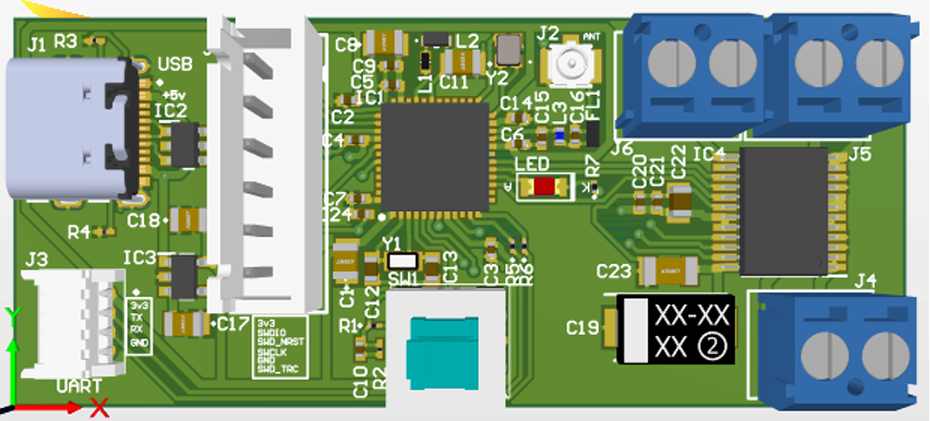
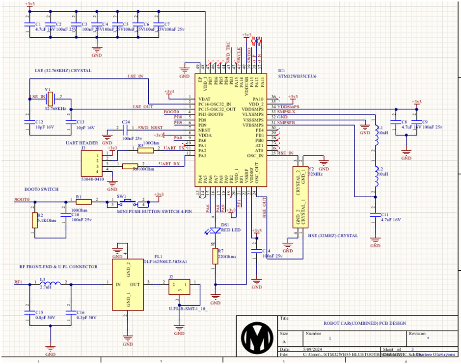
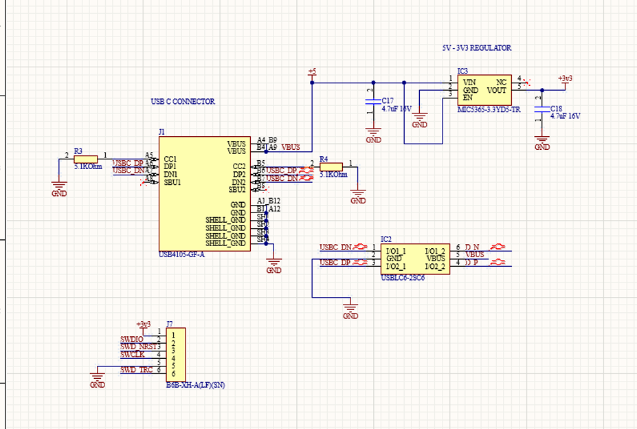
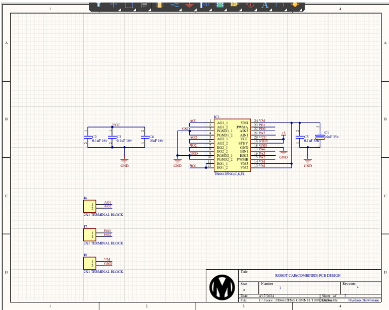
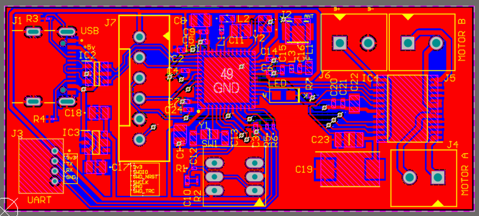
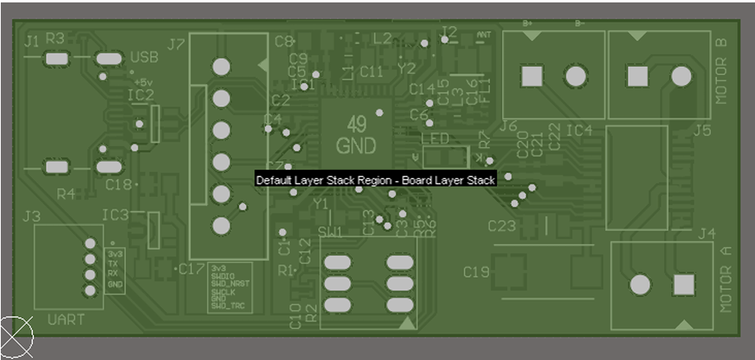

# Bluetooth Robot Car PCB — STM32WB55 + TB6612FNG

> An upgraded robot car PCB using the STM32WB55CEU6 — a wireless microcontroller 
> with built-in Bluetooth Low Energy (BLE) — combined with the TB6612FNG dual 
> motor driver. Designed for wireless motor control applications.

## Overview
This board is an evolution of the robot car combined PCB, upgrading the MCU to the 
STM32WB55CEU6 which has an integrated BLE and IEEE 802.15.4 radio. This enables 
wireless control of the robot car without any external Bluetooth module.

The design includes a full RF frontend with a U.FL antenna connector, low-pass filter, 
matching inductors, USB-C connectivity with onboard USB protection IC, and a dedicated 
SWD debug header.

## Key Features
- STM32WB55CEU6 (Cortex-M4 + Cortex-M0+ dual core, integrated BLE 5.0)
- TB6612FNG dual DC motor driver
- USB-C connector with USBLC6-2SC6 USB protection IC
- U.FL RF antenna connector with matching network (low-pass filter + inductors)
- 32MHz HSE crystal for RF operation + 32.768KHz LSE for RTC
- 5V → 3.3V regulation via MIC5365-3.3YD5-TR LDO
- UART header for serial communication/debugging
- SWD 6-pin debug interface
- Mini push button for BOOT0 selection and RESET
- Board size: 58mm × 25.4mm

## Tools Used
- Altium Designer (schematic capture, PCB layout, 3D render, Gerber output)

## Board Specifications
| Parameter | Value |
|---|---|
| Dimensions | 58mm × 25.4mm |
| Layers | 2 |
| MCU | STM32WB55CEU6 (LQFP-48) |
| Wireless | Bluetooth Low Energy 5.0 (integrated) |
| Motor Driver | TB6612FNG (SOP-24) |
| USB Connector | USB-C |
| Crystal (HSE) | 32MHz (RF) |
| Crystal (LSE) | 32.768KHz (RTC) |
| Antenna Interface | U.FL connector |

## Components Used
- STM32WB55CEU6 Microcontroller (BLE)
- TB6612FNG Dual Motor Driver IC
- MIC5365-3.3YD5-TR LDO Regulator
- USBLC6-2SC6 USB Protection IC
- USB4105-GF-A USB-C Connector
- U.FL-R-SMT-1 Antenna Connector
- DLF162500LT-5028A1 Low Pass Filter
- Inductors: 10nH, 2.7nH, 10µH
- Capacitors: 4.7µF, 100nF, 10pF, 0.8pF, 0.3pF, 10µF, 0.1µF
- Resistors: 100Ω, 220Ω, 5.1kΩ
- Crystal Oscillators: 32MHz, 32.768KHz
- Terminal Block Connectors (Motor A, Motor B, VM)
- Mini Push Button Switch (4-pin)
- Red SMD LED

## Schematic

## PCB Layout

## 3D Render

## Design Process
1. Studied STM32WB55 datasheet for RF frontend requirements
2. Designed 3-sheet schematic: MCU/RF, USB/Power, Motor Driver
3. Sized board to 58mm × 25.4mm to match chassis
4. Placed RF components close to MCU antenna pins to minimize trace length
5. Routed USB differential pairs with care for signal integrity
6. Applied ground pour and generated Gerber files

## What I Learned
- RF-aware PCB design (antenna placement, matching network, ground plane)
- Wireless MCU selection and BLE integration on custom PCBs
- USB-C connector wiring with CC resistors and USB ESD protection
- Differential pair routing for USB D+ / D- signals
- Working with more complex multi-supply ICs (VDDA, VDD, VDDSMPS)
